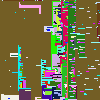

# `rimage` - Random Image Generation

A small script that I wrote for fun while camping out.
This script depends on the tiny [libattopng](https://github.com/misc0110/libattopng) library for `png`-manipulation.
The thing I like the most about C is that you can write so much without access to the internet.

The program simply generates random pixels.
After that, if any neighbouring pixels are very similar to each other, their value is copied.
If that is not the case, the dissimilar pixels are incremented by 1 in all of the color channels.
This quickly generates shapes in the random noise and leaves a nice white background, in most cases.

Here is an example:

